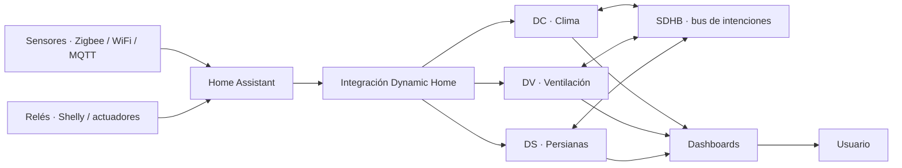

# Dynamic Home

<p align="center">
  
</p>

[](https://github.com/woody-box/Dynamic-Home/actions/workflows/tests.yml)
[](https://hacs.xyz)

[English](README.md) · **Español**

> **Experimental / open source.** Dynamic Home no pretende sustituir sistemas
> profesionales certificados: es una capa avanzada de automatización residencial
> que corre **dentro** de Home Assistant.

**Dynamic Home** es un BMS doméstico (gestión integral del hogar) modular para
Home Assistant: climatización, ventilación y persianas gobernadas por una lógica
de control explicable y coordinadas mediante un bus interno de intenciones. Está
pensado para usuarios avanzados que quieren supervisión, control automatizado,
trazabilidad ("qué decisión tomó el sistema, cuándo y por qué") y coordinación
entre subsistemas.

---

## Para quién es

Dynamic Home es para **usuarios avanzados de Home Assistant** que quieren
gestionar climatización, ventilación y persianas de forma coordinada, explicable
y automatizada. Encaja si tienes:

- Suelo radiante / refrescante con alta inercia térmica.
- Una VMC de varias velocidades controlada por relés.
- Sensores de temperatura, humedad, CO₂, PM2.5 o calidad de aire.
- Persianas motorizadas integradas en Home Assistant.
- Necesidad de trazabilidad: saber qué decidió el sistema y por qué.

## Para quién no es

**No** es una solución de instalar y olvidar. No encaja si:

- No tienes experiencia previa con Home Assistant.
- No quieres revisar sensores, entidades y configuración.
- Esperas sustituir un sistema profesional certificado.
- Vas a conectarlo directamente a equipos críticos sin pruebas previas.
- No puedes validar el comportamiento antes de actuar sobre hardware real.

---

## Módulos

| Módulo | Entidad | Qué controla |
|--------|---------|--------------|
| **DC** · Dynamic Climate | `climate` | Calefacción y suelo refrescante (consigna por zona) |
| **DV** · Dynamic Ventilation | `fan` | VMC de doble flujo (velocidad por calidad de aire) |
| **DS** · Dynamic Shutter | `cover` | Persianas (posición por sol, clima y meteo) |
| **Weather** · Dynamic Weather | `weather` | Opcional: proveedor meteo resiliente multi-fuente (forecast/alertas con fallback) |

<p align="center">
  
  
  
</p>

Los tres comparten el **bus SDHB** (en memoria). **DC es el cerebro**: al
calentar pide a las persianas *ganancia solar* y al enfriar pide *protección
solar*; DS y DV reaccionan. Cada persiana escucha en su **fachada**
(`ds_f<azimut>`), así que una zona de clima puede pedir protección solo a la
fachada soleada y dejar el resto sin tocar. Todo esto antes vivía en miles de
*helpers* YAML; ahora es una integración nativa que se añade desde la interfaz.

---

## Arquitectura



Dynamic Home **no sustituye a Home Assistant**: se ejecuta como integración
personalizada dentro de él. Home Assistant sigue siendo la plataforma de
entidades, automatización, histórico e interfaz. La lógica de decisión vive en
**módulos puros sin dependencias de Home Assistant** (`*_engine.py`); los
*wrappers* de HA solo traducen estado.

---

## Estado del proyecto

| Área | Estado | Comentario |
|------|--------|------------|
| Instalación HACS | Beta | Instalable como integración personalizada |
| Dynamic Climate (DC) | Beta | Clima por zona, biases, lead adaptativo |
| Dynamic Ventilation (DV) | Beta | Velocidad VMC por IAQ y humedad |
| Dynamic Shutter (DS) | Beta | Posición de persiana por fachada/sol/meteo |
| Bus SDHB | Beta | Arbitraje de intenciones en memoria |
| Config flow (UI) | Funcional | Alta + opciones agrupadas por categoría |
| Dashboards de ejemplo | Pendiente | Aún no empaquetados |
| Capturas | Pendiente | Por añadir |

Nada se llama "estable": es **beta funcional / experimental**, en desarrollo
activo y con CI, pero todavía no validado por usuarios externos.

---

## Instalación (HACS)

1. HACS → Integraciones → menú ⋮ → **Repositorios personalizados**.
2. Añade `https://github.com/woody-box/Dynamic-Home` con categoría **Integration**.
3. Instala **Dynamic Home** y reinicia Home Assistant.
4. Ajustes → Dispositivos y servicios → **Añadir integración** → *Dynamic Home*.

### Instalación manual

Copia `custom_components/dynamic_home/` a tu carpeta `config/custom_components/`
y reinicia Home Assistant.

**Requisitos:** Home Assistant ≥ 2024.3.

---

## Primer arranque seguro

Antes de que Dynamic Home actúe sobre hardware real, pruébalo en modo seguro:

1. Instala la integración y añade un módulo (un asistente por instancia).
2. Apúntalo a **entidades dummy** (p.ej. `input_boolean`/`switch` de prueba) en
   vez de a los relés reales.
3. Activa **Observe only** (interruptor por módulo): calcula y publica al bus pero
   **no** toca el hardware.
4. Revisa los sensores de diagnóstico y los **reason codes** para ver cada decisión.
5. Valida el comportamiento durante varios días.
6. Sustituye las entidades dummy por las reales solo cuando el comportamiento sea
   correcto, manteniendo una vía de control manual.

---

## Ejemplos

Configuraciones mínimas listas para copiar (VMC de 3 velocidades, una zona de
clima, una persiana por fachada) en **[`docs/EXAMPLES.md`](docs/EXAMPLES.md)**.

---

## Documentación técnica

- [`docs/SPEC_DC.md`](docs/SPEC_DC.md) — algoritmo de clima (target, biases, bus).
- [`docs/SPEC_DV.md`](docs/SPEC_DV.md) — algoritmo de ventilación (IAQ, EMA, failsafe).
- [`docs/SPEC_DS.md`](docs/SPEC_DS.md) — algoritmo de persianas (cascada + caps).
- [`docs/INTEGRATION.md`](docs/INTEGRATION.md) — arquitectura del port y cómo probar.
- [`docs/REQUIREMENTS.md`](docs/REQUIREMENTS.md) · [`docs/BACKLOG.md`](docs/BACKLOG.md) · [`docs/ROADMAP.md`](docs/ROADMAP.md)

---

## Desarrollo y tests

```bash
python -m venv .venv && source .venv/bin/activate
pip install -r requirements-test.txt
pytest -q
```

La lógica de decisión vive en **módulos puros sin dependencias de HA**
(`*_engine.py`) con tests unitarios; los *wrappers* solo traducen estado. CI
ejecuta toda la batería, `ruff`, `hassfest` y validación HACS en cada push.

---

## Limitaciones conocidas

- El **arbitraje del bus** elige un único ganador por target (prioridad/TTL); un
  intent de mayor prioridad puede enmascarar a otro concurrente en el mismo target.
- La **inferencia de moho y de ventana abierta son heurísticas** (horas de humedad
  con decaimiento / tendencia de temperatura contra la demanda), no funciones de
  seguridad certificadas.
- Las funciones de **energía / FV / batería / VE** están en el roadmap y no están
  validadas por el autor.
- Aún **no** se empaquetan **dashboards de ejemplo** (capturas pendientes).
- Los docs técnicos profundos (`SPEC_*`, `REQUIREMENTS`, `BACKLOG`) están en español.

La suite YAML original v4.2 (referencia / legado) vive en la rama
[`archive/v4.2-source`](https://github.com/woody-box/Dynamic-Home/tree/archive/v4.2-source),
fuera de `main` para mantener el repo ligero.

---

## Seguridad

Dynamic Home puede actuar sobre relés, motores, válvulas, ventiladores o sistemas
de climatización. Una configuración incorrecta puede provocar funcionamiento no
deseado del equipo.

Recomendaciones mínimas:

- Probar primero con entidades dummy.
- Usar **Observe only** antes de permitir actuación real.
- Verificar manualmente cada relé y cada entidad.
- No actuar sobre equipos críticos sin supervisión.
- Respetar la normativa eléctrica y de climatización aplicable.
- Usar protecciones físicas independientes cuando proceda.

El software **no** sustituye protecciones eléctricas, térmicas, mecánicas ni
sistemas certificados de seguridad.

---

## Licencia

MIT — ver [`LICENSE`](LICENSE).
