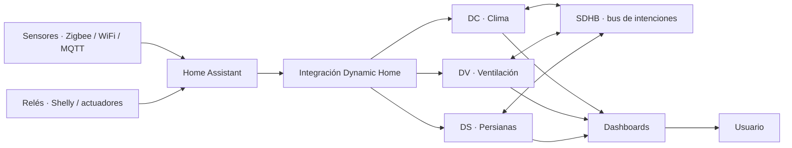

# Dynamic Home

<p align="center">
  
</p>

[](https://github.com/woody-box/Dynamic-Home/actions/workflows/tests.yml)
[](https://hacs.xyz)

[English](README.md) · **Español**

> **Experimental / open source.** Dynamic Home no pretende sustituir sistemas
> profesionales certificados: es una capa avanzada de automatización residencial
> que corre **dentro** de Home Assistant.

**Dynamic Home** es un BMS doméstico (gestión integral del hogar) modular para
Home Assistant: climatización, ventilación y persianas gobernadas por una lógica
de control explicable y coordinadas mediante un bus interno de intenciones. Está
pensado para usuarios avanzados que quieren supervisión, control automatizado,
trazabilidad ("qué decisión tomó el sistema, cuándo y por qué") y coordinación
entre subsistemas.

---

## Para quién es

Dynamic Home es para **usuarios avanzados de Home Assistant** que quieren
gestionar climatización, ventilación y persianas de forma coordinada, explicable
y automatizada. Encaja si tienes:

- Suelo radiante / refrescante con alta inercia térmica.
- Una VMC de varias velocidades controlada por relés.
- Sensores de temperatura, humedad, CO₂, PM2.5 o calidad de aire.
- Persianas motorizadas integradas en Home Assistant.
- Necesidad de trazabilidad: saber qué decidió el sistema y por qué.

## Para quién no es

**No** es una solución de instalar y olvidar. No encaja si:

- No tienes experiencia previa con Home Assistant.
- No quieres revisar sensores, entidades y configuración.
- Esperas sustituir un sistema profesional certificado.
- Vas a conectarlo directamente a equipos críticos sin pruebas previas.
- No puedes validar el comportamiento antes de actuar sobre hardware real.

---

## Módulos

| | Módulo | Entidad | Qué controla |
|---|--------|---------|--------------|
|  | **DC** · Dynamic Climate | `climate` | Calefacción y suelo refrescante (consigna por zona) |
|  | **DV** · Dynamic Ventilation | `fan` | VMC de doble flujo (velocidad por calidad de aire) |
|  | **DS** · Dynamic Shutter | `cover` | Persianas (posición por sol, clima y meteo) |
|  | **Dynamic Weather** | `weather` | Opcional: proveedor meteo resiliente multi-fuente (fallback) |
|  | **Dynamic Home · Zonas** | `select` · `sensor` | Hub de casa: zonas, modos, confort, presencia, changeover, pausa, pico de persianas global |
|  | **Dynamic Energy** | `sensor` | Cerebro de potencia: margen de ICP, tarifa, escasez, totales kWh/€ |

Las dos últimas son hubs de coordinación **opcionales y únicos por casa**
("singleton"). Puedes usar DC/DV/DS por separado, o añadir Zonas/Energía para
coordinar la casa entera.

DC, DV y DS comparten el **bus SDHB** (en memoria). **DC es el cerebro**: al
calentar pide a las persianas *ganancia solar* y al enfriar pide *protección
solar*; DS y DV reaccionan. Cada persiana escucha en su **fachada**
(`ds_f<azimut>`), así que una zona de clima puede pedir protección solo a la
fachada soleada y dejar el resto sin tocar. Todo esto antes vivía en miles de
*helpers* YAML; ahora es una integración nativa que se añade desde la interfaz.

---

## Coordinación de casa y energía

Por encima de los módulos por zona, dos hubs opcionales (uno por casa) coordinan
la vivienda entera.


**Dynamic Home (Zonas)** — el cerebro de la casa:

- **Zonas y grupos** — organiza los módulos en una jerarquía `zona → grupo → casa`
  para que los ajustes de abajo apunten a una habitación, no solo a toda la casa.
- **Modos de casa** (`Home / Away / Sleep / Boost / Eco`, global + override por zona):
  DC entra en vacaciones en *Away*, DV limita su velocidad, y DS también reacciona —
  en *Away* corre **simulación de presencia** y en *Sleep* cierra las persianas de ese ámbito.
- **Presets de confort** (`Eco / Equilibrado / Confort`) escalan la agresividad de DC
  (bandas, lead), DV (umbrales) y el sombreado solar de DS, por ámbito.
- **Presencia** — fusiona sensores de ocupación (PIR / mmWave / puerta / móviles) en
  presencia por zona y de casa, y puede conducir el modo de casa.
- **Simulación de presencia** (anti-okupa) — en *Away*, las persianas imitan a un
  ocupante (abren de día, cierran de noche, con jitter y escalonado); la meteo y lo
  manual mandan por encima.
- **Changeover comunitario** — para suelo radiante a 2 tubos compartido, una dirección
  estacional del agua (`heat / cool / off`) que siguen las zonas de clima *comunitarias*.
- **Pausa maestra** (global + por módulo) — deja a DC / DV / DS de actuar **y** de
  influir en el bus (un *Solo observar* centralizado y por módulo) — p. ej. para
  manejar los termostatos a mano.
- **Pico de persianas global** — pones el presupuesto de arranques de motor (máximo
  simultáneo / potencia / escalonado) **una sola vez** para todas las persianas.

<br clear="left">


**Dynamic Energy** — el cerebro de potencia. Agrega y publica el contexto energético
que leen los demás módulos (nunca manda — cada módulo soberano, la seguridad primero):

- **Margen hasta la potencia contratada (ICP)** — aprieta el presupuesto de **anti-pico
  eléctrico** de las zonas de clima para que varias cargas no disparen el ICP.
- **Estado de tarifa** (`barata / normal / cara`) de un sensor de precio o tramos fijos.
- Binario de **escasez** y **totales de casa kWh / €** que entran en el panel de Energía
  de Home Assistant. Los campos de FV / batería / VE existen pero están **gateados / experimentales**.

<br clear="left">

---

## Arquitectura



Dynamic Home **no sustituye a Home Assistant**: se ejecuta como integración
personalizada dentro de él. Home Assistant sigue siendo la plataforma de
entidades, automatización, histórico e interfaz. La lógica de decisión vive en
**módulos puros sin dependencias de Home Assistant** (`*_engine.py`); los
*wrappers* de HA solo traducen estado.

---

## Estado del proyecto

Versión actual: **v0.98.0**. Proyecto personal, de un solo mantenedor y pre-1.0:
nada es "final" en sentido de producción amplia, así que la escala es relativa.
El eje clave **no es el número de tests** sino el **rodaje en hardware real** —
cuánto ha corrido cada módulo de verdad, no solo en los (606+) tests unitarios.

- **Beta (madura)** — bien cubierto por tests **y** en uso real diario.
- **Beta** — completo y con tests, con rodaje real moderado.
- **Experimental** — funciona pero con poca validación real, o con partes sin construir.

| Módulo | Madurez | Comentario |
|--------|---------|------------|
| Dynamic Ventilation (DV) | 🟢 Beta (madura) | Probado en real con tus relés; velocidad por IAQ + failsafe consolidados |
| Dynamic Shutter (DS) | 🟢 Beta (madura) | Probado en real; endurecido en seguridad tras incidencias reales (dale rodaje) |
| Dynamic Weather (DW) | 🟢 Beta (estable) | Espejo de proveedores + alertas; poca complejidad, poco riesgo |
| Dynamic Climate (DC) | 🟡 Beta / Experimental | Núcleo (base+biases, condensación, changeover) funcional; caminos avanzados (multi-emisor, conducto compartido, anti-pico, anti-ciclado) solo en tests, poco rodaje real |
| Dynamic Home (Zonas) | 🟡 Beta | Zonas, modos, presencia y changeover en uso; presets de confort menos ejercitados |
| Dynamic Energy | 🟠 Experimental | El módulo más nuevo; núcleo (margen/tarifa/coste) testeado; FV/batería/VE diferidos y sin validar |
| Bus SDHB | 🟢 Beta (estable) | Arbitraje de intenciones en memoria, desempate determinista |
| Config flow (UI) | Funcional | Alta + opciones por categoría; reconfigurar y clonar; "Común" de persianas auto-creada |
| FV / batería / VE | 🟠 Experimental | Campos presentes pero gateados; sin validar por el autor |
| Dashboards de ejemplo | Pendiente | Aún no empaquetados |
| Capturas | Pendiente | Por añadir |

Nada se llama "estable": es **beta funcional / experimental**, en desarrollo
activo y con CI, pero todavía no validado por usuarios externos.

---

## Instalación (HACS)

1. HACS → Integraciones → menú ⋮ → **Repositorios personalizados**.
2. Añade `https://github.com/woody-box/Dynamic-Home` con categoría **Integration**.
3. Instala **Dynamic Home** y reinicia Home Assistant.
4. Ajustes → Dispositivos y servicios → **Añadir integración** → *Dynamic Home*.

### Instalación manual

Copia `custom_components/dynamic_home/` a tu carpeta `config/custom_components/`
y reinicia Home Assistant.

**Requisitos:** Home Assistant ≥ 2024.3.

---

## Primer arranque seguro

Antes de que Dynamic Home actúe sobre hardware real, pruébalo en modo seguro:

1. Instala la integración y añade un módulo (un asistente por instancia).
2. Apúntalo a **entidades dummy** (p.ej. `input_boolean`/`switch` de prueba) en
   vez de a los relés reales.
3. Activa **Observe only** (interruptor por módulo): calcula y publica al bus pero
   **no** toca el hardware.
4. Revisa los sensores de diagnóstico y los **reason codes** para ver cada decisión.
5. Valida el comportamiento durante varios días.
6. Sustituye las entidades dummy por las reales solo cuando el comportamiento sea
   correcto, manteniendo una vía de control manual.

---

## Ejemplos

Configuraciones mínimas listas para copiar (VMC de 3 velocidades, una zona de
clima, una persiana por fachada) en **[`docs/EXAMPLES.md`](docs/EXAMPLES.md)**.

¿Empiezas? Ve a **[`docs/QUICKSTART.md`](docs/QUICKSTART.md)** — monta una zona de clima
ficticia y lee los *reason codes* en ~10 minutos, sin tocar hardware. Luego
**[`docs/PROFILES.md`](docs/PROFILES.md)** tiene una receta por tipo de instalación real
(radiante comunitario, VMC de 3 velocidades, persianas motorizadas, bomba de calor con
tarifa). Para entender los muchos ajustes, **[`docs/TUNING.md`](docs/TUNING.md)** los agrupa
por objetivo ("que anticipe más", "que deje de oscilar", "que respete el ICP").

---

## Documentación técnica

- [`docs/SPEC_DC.md`](docs/SPEC_DC.md) — algoritmo de clima (target, biases, bus).
- [`docs/SPEC_DV.md`](docs/SPEC_DV.md) — algoritmo de ventilación (IAQ, EMA, failsafe).
- [`docs/SPEC_DS.md`](docs/SPEC_DS.md) — algoritmo de persianas (cascada + caps).
- [`docs/INTEGRATION.md`](docs/INTEGRATION.md) — arquitectura del port y cómo probar.
- [`docs/QUICKSTART.md`](docs/QUICKSTART.md) — zona ficticia + reason codes en 10 min (onboarding).
- [`docs/PROFILES.md`](docs/PROFILES.md) — recetas por perfil de instalación real.
- [`docs/TUNING.md`](docs/TUNING.md) — guía de parámetros por objetivo.
- [`docs/REQUIREMENTS.md`](docs/REQUIREMENTS.md) · [`docs/BACKLOG.md`](docs/BACKLOG.md) · [`docs/ROADMAP.md`](docs/ROADMAP.md)

---

## Desarrollo y tests

```bash
python -m venv .venv && source .venv/bin/activate
pip install -r requirements-test.txt
pytest -q
```

La lógica de decisión vive en **módulos puros sin dependencias de HA**
(`*_engine.py`) con tests unitarios; los *wrappers* solo traducen estado. CI
ejecuta toda la batería, `ruff`, `hassfest` y validación HACS en cada push.

---

## Limitaciones conocidas

- El **arbitraje del bus** elige un único ganador por target (prioridad/TTL); un
  intent de mayor prioridad puede enmascarar a otro concurrente en el mismo target.
- La **inferencia de moho y de ventana abierta son heurísticas** (horas de humedad
  con decaimiento / tendencia de temperatura contra la demanda), no funciones de
  seguridad certificadas.
- **Dynamic Energy** ofrece estado de tarifa, margen de ICP y anti-pico eléctrico;
  los campos de **FV / batería / VE** están presentes pero **gateados y sin validar**
  por el autor.
- Aún **no** se empaquetan **dashboards de ejemplo** (capturas pendientes).
- Los docs técnicos profundos (`SPEC_*`, `REQUIREMENTS`, `BACKLOG`) están en español.

La suite YAML original v4.2 (referencia / legado) vive en la rama
[`archive/v4.2-source`](https://github.com/woody-box/Dynamic-Home/tree/archive/v4.2-source),
fuera de `main` para mantener el repo ligero.

---

## Seguridad

Dynamic Home puede actuar sobre relés, motores, válvulas, ventiladores o sistemas
de climatización. Una configuración incorrecta puede provocar funcionamiento no
deseado del equipo.

Recomendaciones mínimas:

- Probar primero con entidades dummy.
- Usar **Observe only** antes de permitir actuación real.
- Verificar manualmente cada relé y cada entidad.
- No actuar sobre equipos críticos sin supervisión.
- Respetar la normativa eléctrica y de climatización aplicable.
- Usar protecciones físicas independientes cuando proceda.

El software **no** sustituye protecciones eléctricas, térmicas, mecánicas ni
sistemas certificados de seguridad.

---

## Licencia

MIT — ver [`LICENSE`](LICENSE).
