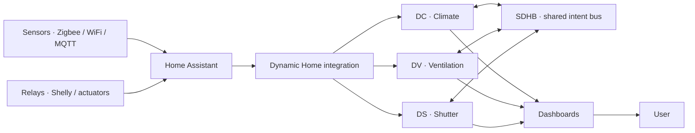

# Dynamic Home

<p align="center">
  
</p>

[](https://github.com/woody-box/Dynamic-Home/actions/workflows/tests.yml)
[](https://hacs.xyz)

**English** · [Español](README.es.md)

> **Experimental / open source.** Dynamic Home does not replace certified
> professional systems — it is an advanced residential automation layer that
> runs **inside** Home Assistant.

**Dynamic Home** is a modular residential BMS (building management system) for
Home Assistant: climate, ventilation and shutters driven by explainable control
logic and coordinated through an internal intent bus. It is aimed at advanced
users who want supervision, automated control, traceability ("which decision did
the system take, when and why") and coordination between subsystems.

---

## Who is it for

Dynamic Home is for **advanced Home Assistant users** who want to manage heating,
ventilation and shutters in a coordinated, explainable, automated way. It is a
good fit if you have:

- Radiant heating / cooling with high thermal inertia.
- A multi-speed HVU/HRV (VMC) driven by relays.
- Temperature, humidity, CO₂, PM2.5 or air-quality sensors.
- Motorized shutters integrated in Home Assistant.
- A need for traceability — knowing what the system decided and why.

## Who is it *not* for

It is **not** a plug-and-forget solution. It is not a good fit if you:

- Have no prior experience with Home Assistant.
- Don't want to review sensors, entities and configuration.
- Expect it to replace a certified professional system.
- Plan to wire it straight to critical equipment without testing first.
- Cannot validate the behaviour before acting on real hardware.

---

## Modules

| Module | Entity | Controls |
|--------|--------|----------|
| **DC** · Dynamic Climate | `climate` | Heating and radiant cooling (per-zone setpoint) |
| **DV** · Dynamic Ventilation | `fan` | Dual-flow HRV (speed by air quality) |
| **DS** · Dynamic Shutter | `cover` | Shutters (position by sun, climate and weather) |
| **Dynamic Weather** | `weather` | Optional: resilient multi-source forecast/alert provider (fallback) |
| **Dynamic Home · Zones** | `select` · `sensor` | House hub: zones/groups, modes, comfort, presence, changeover, master pause, global shutter peak |
| **Dynamic Energy** | `sensor` | House power brain: ICP headroom, tariff state, scarcity, kWh/€ totals — feeds the anti-peak budget |

The last two are optional, **one-per-house** ("singleton") coordination hubs. You
can run DC/DV/DS standalone, or add Zones/Energy to coordinate the whole house.

<p align="center">
  
  
  
</p>

All three share the **SDHB** bus (in memory). **DC is the brain**: while heating
it asks the shutters for *solar gain*, and while cooling it asks for *solar
shield*; DS and DV react. Each shutter listens on its **facade**
(`ds_f<azimuth>`), so a climate zone can request shielding only on the sunlit
facade and leave the rest untouched. This logic used to live in thousands of YAML
helpers; it is now a native integration you add from the UI.

---

## House coordination & energy

Beyond the per-zone modules, two optional singleton hubs coordinate the whole house.

**Dynamic Home (Zones)** — the house brain:

- **Zones & groups** — organize modules into a `zone → group → house` hierarchy so
  the settings below can target a room, not just the whole house.
- **House modes** (`Home / Away / Sleep / Boost / Eco`, global + per-zone override):
  DC enters vacation on *Away*, DV caps its speed, and DS reacts too — *Away* runs
  **presence simulation** and *Sleep* closes the shutters in that scope.
- **Comfort presets** (`Eco / Balanced / Comfort`) scale the aggressiveness of DC
  (bands, lead) and DV (thresholds), and DS solar shading, per scope.
- **Presence** — fuses occupancy sensors (PIR / mmWave / door / phones) into per-zone
  and house presence, and can drive the house mode.
- **Presence simulation** (anti-burglary) — in *Away*, shutters mimic an occupant
  (open by day, close by night, jittered & staggered); weather and manual still win.
- **Community changeover** — for 2-pipe shared radiant systems, a seasonal water
  direction (`heat / cool / off`) that the *community* climate zones follow.
- **Master pause** (global + per-module) — stop DC / DV / DS actuating **and**
  influencing the bus (a centralized, per-module *Observe only*) — e.g. to drive the
  thermostats by hand.
- **Global shutter peak limiting** — set the motor-inrush budget (max simultaneous
  starts / power / stagger) **once** for every shutter.

**Dynamic Energy** — the house power brain. It aggregates and publishes energy
context that the other modules read (it never commands — each module stays sovereign,
safety first):

- **Import headroom** under the contracted power (ICP) — tightens the **electric
  peak-shaving** budget of climate zones so several loads don't trip the breaker.
- **Tariff state** (`cheap / normal / peak`) from a price sensor or fixed bands.
- **Scarcity** binary, and **house kWh / € totals** that feed Home Assistant's Energy
  dashboard. PV / battery / EV fields exist but are **gated / experimental**.

---

## Architecture



Dynamic Home **does not replace Home Assistant**: it runs as a custom integration
inside it. Home Assistant remains the platform for entities, automation, history
and UI. The decision logic lives in **pure modules with no Home Assistant
dependency** (`*_engine.py`); the HA wrappers only translate state.

---

## Project status

Current release: **v0.72.0**.

| Area | Status | Notes |
|------|--------|-------|
| HACS install | Beta | Installable as a custom integration |
| Dynamic Climate (DC) | Beta | Per-zone climate, biases, adaptive lead, install profiles |
| Dynamic Ventilation (DV) | Beta | VMC speed by IAQ, humidity, dew point |
| Dynamic Shutter (DS) | Beta | Position by facade/sun/weather; modes, presence sim, global peak |
| Dynamic Home (Zones) | Beta | Zones, house modes, comfort, presence, changeover, master pause |
| Dynamic Energy | Beta | ICP headroom, tariff, scarcity, kWh/€ totals, anti-peak budget |
| SDHB bus | Beta | In-memory intent arbitration |
| Config flow (UI) | Functional | Setup + options grouped by category; reconfigure & clone |
| PV / battery / EV | Experimental | Fields present but gated; not validated by the author |
| Example dashboards | Pending | Not packaged yet |
| Screenshots | Pending | To be added |

Nothing here is called "stable": it is **functional beta / experimental**, in
active development and tested by CI, but not yet validated by external users.

---

## Installation (HACS)

1. HACS → Integrations → ⋮ menu → **Custom repositories**.
2. Add `https://github.com/woody-box/Dynamic-Home` with category **Integration**.
3. Install **Dynamic Home** and restart Home Assistant.
4. Settings → Devices & services → **Add integration** → *Dynamic Home*.

### Manual installation

Copy `custom_components/dynamic_home/` to your `config/custom_components/` folder
and restart Home Assistant.

**Requirements:** Home Assistant ≥ 2024.3.

---

## Safe first run

Before letting Dynamic Home act on real hardware, run it in a safe mode:

1. Install the integration and add a module (a wizard runs per instance).
2. Point it at **dummy entities** (e.g. test `input_boolean`/`switch` helpers)
   instead of the real relays.
3. Turn on **Observe only** (per-module switch): it computes and publishes to the
   bus but does **not** touch hardware.
4. Watch the diagnostic sensors and **reason codes** to see each decision.
5. Validate the behaviour over several days.
6. Swap dummy entities for real ones only once the behaviour is correct, and keep
   a manual override path available.

---

## Examples

Minimal, copy-pasteable setups (3-speed VMC, a climate zone, a shutter by facade)
live in **[`docs/EXAMPLES.md`](docs/EXAMPLES.md)**.

New here? Start with **[`docs/QUICKSTART.md`](docs/QUICKSTART.md)** — stand up a dummy
climate zone and read the decision *reason codes* in ~10 minutes, without touching any
hardware. Then **[`docs/PROFILES.md`](docs/PROFILES.md)** has one recipe per real install
type (communal radiant, 3-speed VMC, motorized shutters, heat pump with a tariff). To make
sense of the many tunables, **[`docs/TUNING.md`](docs/TUNING.md)** groups them by goal
("make it anticipate more", "stop it oscillating", "respect the main breaker") and says
which knobs move together.

---

## Technical documentation

> The deep specs below are written in Spanish.

- [`docs/SPEC_DC.md`](docs/SPEC_DC.md) — climate algorithm (target, biases, bus).
- [`docs/SPEC_DV.md`](docs/SPEC_DV.md) — ventilation algorithm (IAQ, EMA, failsafe).
- [`docs/SPEC_DS.md`](docs/SPEC_DS.md) — shutter algorithm (cascade + caps).
- [`docs/INTEGRATION.md`](docs/INTEGRATION.md) — port architecture and how to test.
- [`docs/QUICKSTART.md`](docs/QUICKSTART.md) — 10-min dummy zone + reason codes (onboarding).
- [`docs/PROFILES.md`](docs/PROFILES.md) — recipes per real install profile.
- [`docs/TUNING.md`](docs/TUNING.md) — parameter guide by goal (what to move, what to watch together).
- [`docs/REQUIREMENTS.md`](docs/REQUIREMENTS.md) · [`docs/BACKLOG.md`](docs/BACKLOG.md) · [`docs/ROADMAP.md`](docs/ROADMAP.md)

---

## Development & tests

```bash
python -m venv .venv && source .venv/bin/activate
pip install -r requirements-test.txt
pytest -q
```

The decision logic lives in **pure, HA-independent modules** (`*_engine.py`) with
unit tests; the HA wrappers only translate state. CI runs the full suite, `ruff`,
`hassfest` and HACS validation on every push.

---

## Known limitations

- **Bus arbitration** picks a single winner per target by priority/TTL; a
  higher-priority intent can mask a concurrent one on the same target.
- **Mold and open-window inference are heuristics** (humidity hours with decay /
  temperature trend against demand), not certified safety functions.
- **Dynamic Energy** provides tariff state, ICP import headroom and electric
  peak-shaving; **PV / battery / EV** fields are present but **gated and not
  validated** by the author.
- **No example dashboards** are packaged yet (screenshots pending).
- Deep technical docs (`SPEC_*`, `REQUIREMENTS`, `BACKLOG`) are in Spanish.

The original YAML suite v4.2 (reference / legacy) lives on the
[`archive/v4.2-source`](https://github.com/woody-box/Dynamic-Home/tree/archive/v4.2-source)
branch, kept off `main` to keep the repo light.

---

## Safety

Dynamic Home can act on relays, motors, valves, fans and climate equipment. An
incorrect configuration can cause unwanted behaviour of that equipment.

Minimum recommendations:

- Test first with dummy entities.
- Use **Observe only** before allowing real actuation.
- Verify each relay and entity manually.
- Do not act on critical equipment without supervision.
- Respect the applicable electrical and HVAC regulations.
- Use independent physical protections where appropriate.

The software does **not** replace electrical, thermal, mechanical or certified
safety systems.

---

## License

MIT — see [`LICENSE`](LICENSE).
