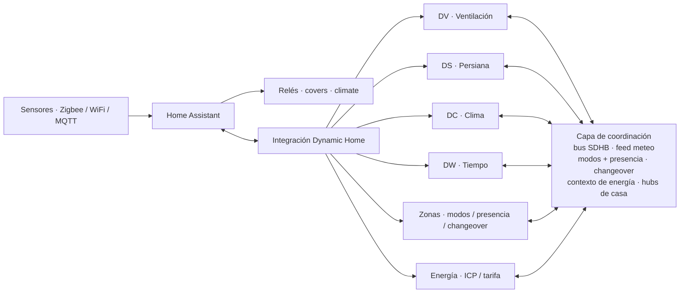

# Dynamic Home — arquitectura de la integración y cómo probar

Dynamic Home es una **integración nativa de Home Assistant** (`custom_components/dynamic_home`)
que porta y amplía la suite YAML original (rama `archive/v4.2-source`). Cada instancia es un
**config entry** independiente y todos comparten una **capa de coordinación en memoria**, de
modo que los módulos se coordinan sin llamarse entre sí.

## Módulos

La integración tiene hoy **6 módulos** que se añaden desde la UI, más un módulo interno
**auto-singleton** que se crea y se elimina solo:

| Módulo | `CONF_MODULE` | Entidad principal | Qué hace |
|--------|---------------|-------------------|----------|
| **DV** · Dynamic Ventilation | `vmc` | `fan` | VMC de doble flujo (velocidad por calidad de aire) |
| **DS** · Dynamic Shutter | `shutter` | `cover` | Persianas (posición por sol, clima y meteo) |
| **DC** · Dynamic Climate | `climate_zone` | `climate` | Calefacción / refrigeración radiante por zona |
| **DW** · Dynamic Weather | `weather` | `weather` | Proveedor resiliente multi-fuente (forecast + alertas, con failover) |
| **Zonas** · Dynamic Home | `zones` | `select` · `sensor` | Hub de casa: zonas/grupos, modos, presencia, changeover, pausa, pico global de persianas |
| **Energía** · Dynamic Energy | `energy` | `sensor` | Cerebro eléctrico: margen de ICP, tarifa, escasez, kWh/€ |
| **Dynamic Shutter · Común** *(interno)* | `shutter_common` | `sensor` · `switch` · `button` | Pantalla común de persianas (recuentos + sol) e interruptores globales |

**DV, DS y DC** son módulos por-instancia (una VMC, una persiana, una zona de clima; puedes
tener varios de cada uno). **Zonas**, **Energía** y **Weather** son **singletons**
(uno por casa). Puedes correr DV/DS/DC en solitario, o añadir Zonas/Energía para coordinar
toda la casa.

La **Común** (`shutter_common`) **no está en el menú de alta**: se **crea sola** con la
primera persiana (`_ensure_common_entry` en `__init__.py`) y se **elimina con la última**
(`async_remove_entry`). Agrupa, en su propio dispositivo, la pantalla compartida de persianas
—recuentos abiertas/cerradas/entreabiertas y datos de sol (amanecer, anochecer, azimut,
elevación, día/noche)— y los **interruptores globales** que actúan sobre TODAS las persianas a
la vez (solo-observar global, protección meteo, escudo térmico, escudo de sol directo,
aislamiento nocturno, amanecer gradual, sombreado geométrico, limitación de pico + botón
"Reanudar automático").

Los `CONF_MODULE`, las plataformas por módulo (`PLATFORMS_*`) y el dispatch viven en
`const.py`; la ramificación de setup está en `async_setup_entry` (`__init__.py`).

## Arquitectura

Dynamic Home **no reemplaza a Home Assistant**: corre como integración dentro de él. HA sigue
siendo la plataforma de entidades, automatización, historial y UI. La **lógica de decisión
vive en motores puros** `*_engine.py` **sin ninguna dependencia de Home Assistant** (Python
puro, testeable en CI sin levantar HA): `dv_engine.py`, `ds_engine.py`, `dc_engine.py`,
`energy_engine.py`, `weather_engine.py`. Los **wrappers de HA** (`coordinator_*.py` + las
plataformas `fan`/`cover`/`climate`/`sensor`/…) solo **traducen estado**: leen entidades de HA
hacia los `*Inputs` del motor y aplican el resultado a los relés/servicios.

Los módulos están **desacoplados**: en vez de llamarse unos a otros, **publican en / leen de
una capa de coordinación compartida** que vive en `hass.data[DOMAIN]`:

- **Bus SDHB de intenciones** (`bus.py` / `SdhbHub`, puro): **DC es el cerebro** y publica
  intenciones (`request_solar_gain` / `request_solar_shield` / secado) que **DS y DV consumen**.
  Arbitra por prioridad/TTL con desempate determinista (nombre de fuente, estable entre
  reinicios) y soporta **targets de fachada**: cada persiana escucha en `ds` (broadcast) y en
  su fachada `ds_f<azimut>`, así una zona de clima protege solo la fachada soleada.
- **`DATA_WEATHER`** — feed de Dynamic Weather (fuente de forecast + alerta) que DC y DS
  auto-consumen cuando existe.
- **`DATA_MODE` / `DATA_PRESENCE`** — modos de casa (`Home/Away/Sleep/Boost/Eco`), presets de
  confort, presencia fusionada y **pausa** por módulo, publicados por Zonas.
- **`DATA_CHANGEOVER`** — dirección estacional del agua (calor/frío/off) para sistemas
  radiantes comunitarios de 2 tubos.
- **`DATA_ENERGY`** — contexto eléctrico (margen bajo el ICP, tarifa, escasez) que Energía
  publica y el presupuesto anti-pico de DC lee. Energía **nunca ordena**: cada módulo sigue
  siendo soberano (seguridad primero).
- **Hubs de casa** — `AntiCycleHub` (anti-ciclado del compresor, F09), `PeakLoadHub`
  (anti-pico eléctrico; canales separados `_peak_dc` sostenido y `_peak_ds` de arranque de
  motores, F03) y `SharedEmitterHub` (reconciliación del conducto compartido entre zonas de un
  grupo, F25).

**Targeting solar dinámico:** DC, en cada ciclo, calcula con `dc_engine.sunlit_facades()` qué
fachadas están soleadas (sol sobre el horizonte y dentro del span de la fachada) y publica la
intención solo a esas fachadas, reconciliando los slots del bus (limpia las que dejan de estar
soleadas). Sin datos de sol/fachadas, hace fallback al target configurado. Cada persiana aporta
su ángulo de aceptación (`facade_span_deg`).

Los coordinadores **leen las opciones en vivo cada ciclo**, así que un cambio de umbral se
aplica con un simple refresco sin tirar el estado de runtime (EMA, contadores de failsafe,
histórico de tendencia). Solo la estructura de zonas y el toggle de espejos fuerzan un reload
(ver `_async_options_updated`).

### Diagrama



## Config flow

El asistente de alta (`config_flow.py`, `async_step_user`) muestra un **menú** para elegir qué
módulo añadir: **VMC / Persiana / Clima / Tiempo / Zonas / Energía**
(`menu_options=["vmc", "shutter", "climate", "weather", "zones", "energy"]`). La **Común**
(`shutter_common`) **no aparece** en el menú: es auto-creada.

- **Singletons** (`weather`, `zones`, `energy`): una `unique_id` fija impide altas duplicadas.
- **Persianas — clonar**: al añadir una persiana puedes **copiar los datos y las opciones de
  otra persiana** ya configurada (todo salvo su `cover` y su nombre), para configurar una y
  clonarla en las hermanas casi idénticas.
- **Reconfigurar** (options flow → paso `hardware`): edita las entidades/relés elegidos tras el
  alta (añadir/cambiar/quitar) sin borrar y recrear la entrada, conservando opciones e
  historial. El resto del menú de opciones expone las categorías de tunables, presets,
  programador semanal (VMC/Clima), baños (VMC), editor de emisores + tipo de instalación
  (Clima) y clonar (persianas).

## Estructura

```
custom_components/dynamic_home/
├── __init__.py                 # setup/unload por entry, dispatch por módulo, servicios, singleton Común
├── const.py                    # DOMAIN, MODULE_*, PLATFORMS_*, CONF_*/DATA_* (fuente de verdad)
├── config_flow.py              # asistente de alta + options flow (reconfigurar/clonar/categorías)
├── options_spec.py             # catálogo de parámetros ajustables (por módulo/categoría)
│
├── dv_engine.py                # ★ lógica PURA DV (ventilación / IAQ)
├── ds_engine.py                # ★ lógica PURA DS (persiana)
├── dc_engine.py                # ★ lógica PURA DC (clima)
├── energy_engine.py            # ★ lógica PURA de energía (margen ICP, tarifa, coste)
├── weather_engine.py           # ★ lógica PURA de agregación meteo (failover por campo)
│
├── coordinator.py              # shim: re-exporta coordinators + SdhbHub
├── coordinator_dv.py / _ds.py / _dc.py
├── coordinator_weather.py / _zones.py / _energy.py / _shutter_common.py
│
├── bus.py                      # SdhbHub (bus de intenciones, puro)
├── anticycle.py                # AntiCycleHub (F09)  ·  peak.py  PeakLoadHub (F03)
├── shared_emitter.py           # SharedEmitterHub (F25)  ·  repairs.py  DegradedTracker (F07)
│
├── fan.py / cover.py / climate.py / weather.py
├── sensor.py / binary_sensor.py / number.py / switch.py / button.py / time.py / select.py
├── strings.json                # textos UI (base)
└── translations/{en,es}.json   # traducciones (paridad obligatoria con strings.json)
```

## Cómo probar

La suite tiene **~608 tests** (motores puros + integración por módulo). Desde la raíz del repo:

```bash
python -m venv .venv && source .venv/bin/activate
pip install -r requirements-test.txt

pytest tests/ -p no:randomly -q          # suite completa (determinista)
ruff check custom_components tests        # lint
```

Además, **paridad de traducciones**: `strings.json`, `translations/en.json` y
`translations/es.json` deben tener exactamente el mismo conjunto de claves (lo verifica
`tests/test_translations.py`).

Cómo está organizada la suite:

- **Motores puros en aislamiento** — `test_dv_engine.py`, `test_ds_engine.py`,
  `test_dc_engine.py`, `test_energy_engine.py`, más los hubs/utilidades puras
  (`test_hub.py`, `test_bus_sensor.py`, `test_peak.py`, `test_anticycle.py`,
  `test_shared_emitter.py`, `test_comfort.py`, `test_modes.py`, `test_schedule.py`,
  `test_install.py`, `test_changeover.py`, `test_reason_text.py`, `test_options_spec.py`).
  Son Python puro: sustituyen a los "golden" YAML del legacy.
- **Integración por módulo dentro de un Home Assistant simulado** — la integración se **carga
  en un HA de test**, se crea el config entry y se verifican entidades y comportamiento:
  `test_integration.py` (VMC), `test_ds_integration.py`, `test_dc_integration.py`,
  `test_energy_integration.py`, `test_presence_integration.py`, `test_weather.py`,
  `test_zones.py`, `test_energy.py`, `test_presence.py`, `test_multi_instance.py`,
  `test_lifecycle.py`, `test_services.py`, `test_repairs.py`, `test_diagnostics.py`,
  `test_events.py`, `test_filter*.py`, `test_staging.py`, `test_emitters.py`,
  `test_dc_adaptive.py`.

Los tests de integración cubren la coordinación entre módulos: el **triángulo** (DC en cool →
bus → DS se clampa en la fachada soleada), el targeting solar dinámico (al moverse el sol
re-dirige la intención), la propagación de modos/presencia/changeover desde Zonas, el
presupuesto anti-pico alimentado por Energía y el **ciclo de vida** (al descargar una entrada
se liberan sus slots del bus y los hubs compartidos; la Común aparece con la primera persiana y
desaparece con la última).

CI ejecuta la suite completa, `ruff`, `hassfest` y la validación HACS en cada push.
